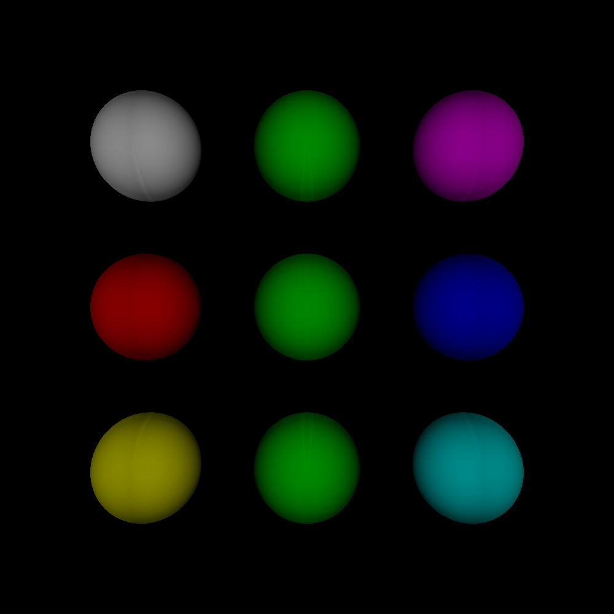
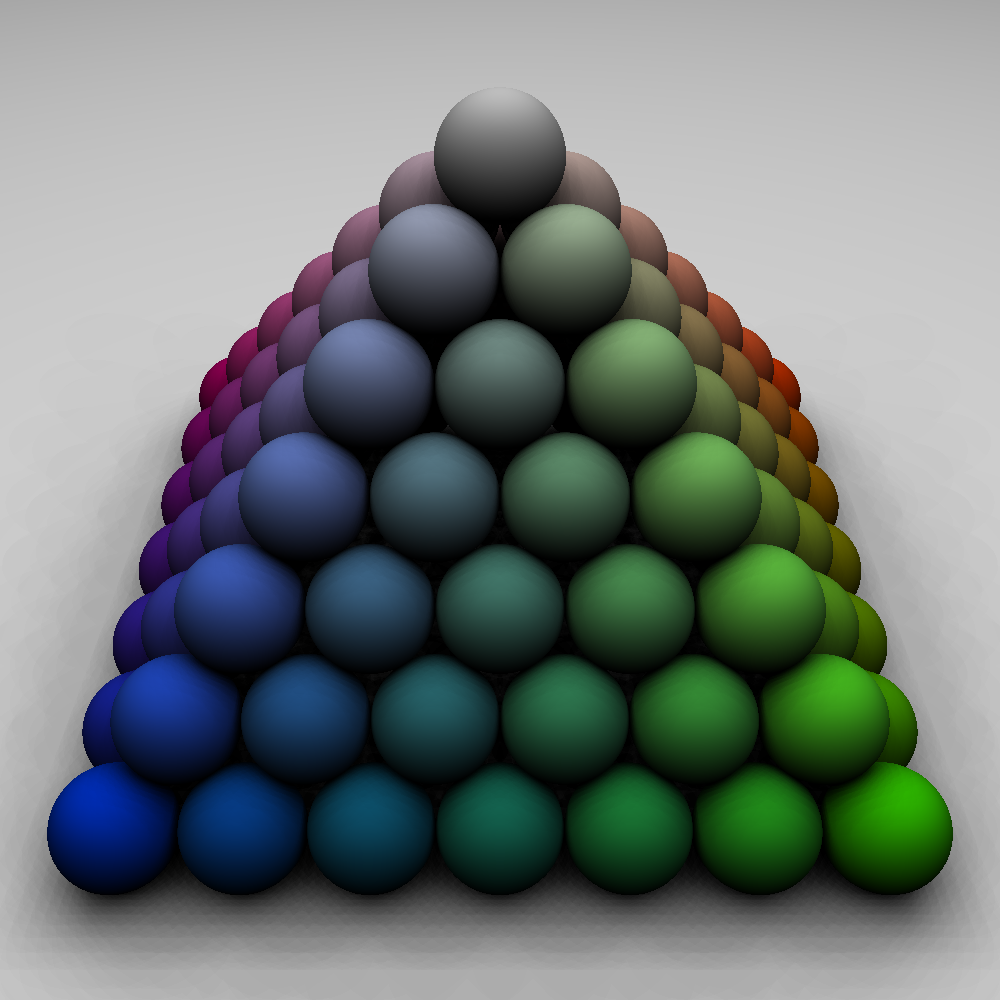
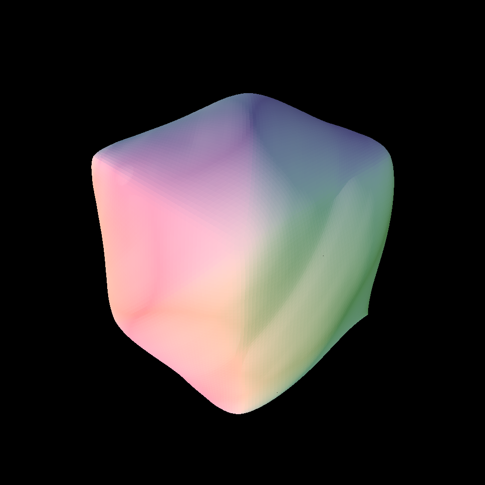

# Ray Tracing Project

## Overview

This project implements a simple ray tracer in **C++**, built using **CMake** and the **Tira** library. The ray tracer reads scene files containing information about geometric primitives such as spheres, planes, and triangles, along with light and camera properties. The program renders the scene using ray tracing techniques, producing images with shadows, reflections, and colored lights.

### Ray Tracing Algorithm

Ray tracing is a rendering technique that traces rays from the camera through each pixel and calculates the color by simulating the interaction of rays with objects in the scene. The ray tracer in this project includes the following stages:
1. **Ray generation**: Rays are cast from the camera to the scene.
2. **Intersection tests**: The rays are tested for intersections with spheres, planes, and triangles.
3. **Lighting calculations**: After finding intersections, the program computes lighting based on the position and color of lights in the scene.
4. **Shadows**: The ray tracer handles shadows by testing whether the light reaches the intersection point without being blocked by other objects.
5. **Profiling**: The program logs the time spent in different sections of the algorithm to help analyze performance.

## Features

- **Ray-Sphere Intersection**: The program computes intersections between rays and spheres, applying Phong lighting to determine the color at the intersection point.
- **Ray-Plane Intersection**: Infinite planes are supported, where the program calculates the intersection of rays with planes.
- **Ray-Triangle Intersection**: This feature allows rendering of mesh objects made of triangles.
- **Colored Lights and Objects**: Both lights and objects can be assigned colors, allowing for more realistic and vivid scene rendering.
- **Ray-Traced Shadows**: Shadows are computed by checking if other objects block the path between the intersection point and the light source.
- **Camera Configuration**: The camera's position, field of view (FOV), and aspect ratio can be configured through the scene file.
- **Resolution Control**: The image resolution is adjustable, allowing for different levels of rendering quality.
- **Performance Profiling**: Time spent in each section of the ray tracing algorithm is logged and displayed in the console, allowing you to analyze performance bottlenecks.

### Prerequisites

- C++ compiler (GCC, Clang, or MSVC)
- CMake (version 3.10 or higher)
- Tira Library

## Output Images

